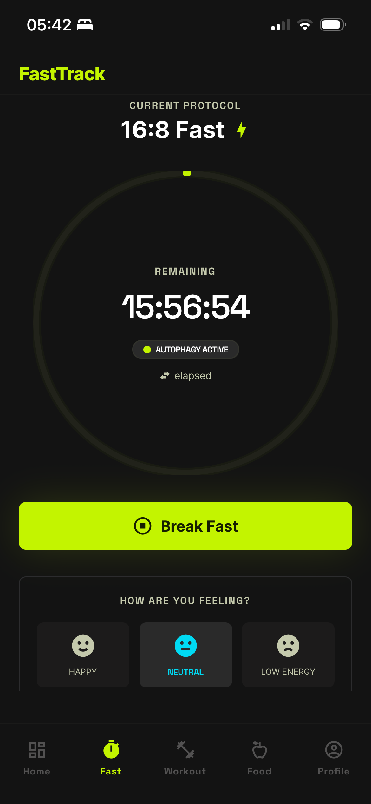
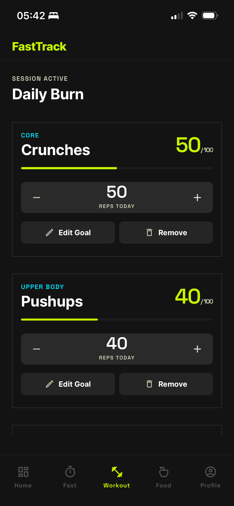
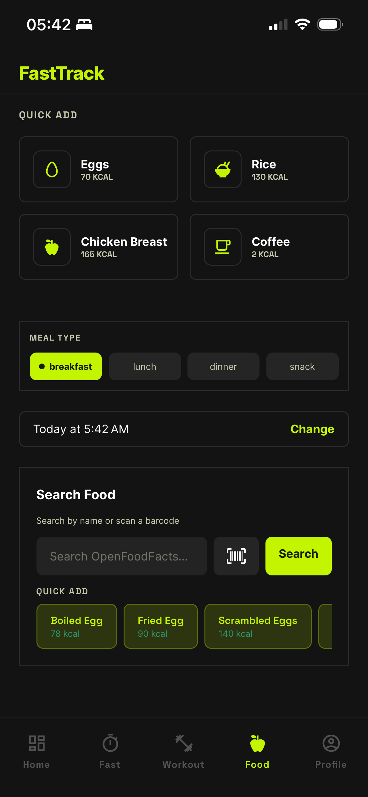

# FastTrack

**Intermittent fasting, workout & macro tracker built with Expo + Supabase.**

A lightweight, streamlined mobile app for tracking of intermittent fasting cycles, daily workout targets, macros and hydration.

Existing fasting/fitness tracker apps have become visually cluttered and rely heavily on aggressive monetisation via premium tiers. I built this to escape that model and return to a straightforward, feature-rich experience at zero cost.

Expo's unified codebase reduces the overhead of native development while maintaining a high-performance experience across both iOS and Android.

---

## Screenshots

| Fasting | Workouts | Food Logging |
|---------|----------|--------------|
|  |  |  |

---

## Features

### Fasting
- **Countdown timer** with animated SVG progress ring, dynamic phase labels
- **Schedule presets**: 14:10, 16:8, 18:6, 20:4, OMAD — plus custom via stepper
- **Weekly calendar** showing which days you fasted
- **Full month calendar** with tap-to-view fast details
- **Mood check-ins** during fasts with chart and timeline
- **Previous fasts** list with expandable detail and bottom-sheet delete
- **End eating / discard fast** via bottom-sheet confirmation modals

### Workouts
- **Exercise panels** for pushups, crunches, sit-ups, squats + custom
- **Log sets** with stepper controls (no keyboard needed)
- **Daily goal editor** via bottom-sheet modal with presets + stepper
- **Progress tracking** with inline progress rings
- **Calorie estimation** based on reps and body weight

### Nutrition
- **Full-screen food logging** (`LogMealModal`) with search, quick-add, custom form, and meal builder
- **Food search** via OpenFoodFacts Edge Function proxy with custom in-app QWERTY keyboard
- **Quick-add** common foods, configurable via multi-select chip editor
- **Custom item form** with stepper controls (no system keyboard needed)
- **Barcode scanner** for packaged foods
- **Quantity modal** before adding to staging
- **Meal calendar** with month view, dot indicators, and day-tap meal details
- **Date/time picker** bottom-sheet with Yesterday/Today shortcuts
- **Water tracking** with selectable presets and custom input

### Profile & Settings
- **Weight tracking** with chart and goal weight
- **Unit preferences**: kg/lbs, cm/ft, ml/fl oz
- **Dark/light mode** with full theme support
- **Local notifications** for fast reminders, water, and milestones
- **Settings inline** (no standalone settings page)
- **Dynamic fasting phase insights** during active fasts

### Offline Support
- **Query cache hydration** — last-known data shown on app boot without network
- **Mutation queue** — all inserts/updates/deletes enqueue when offline, replay on reconnect
- **Smart queue processor** — skips individual failed items, retries with delay
- **Food log staging persistence** — meal building survives app restart
- **Connectivity detection** via NetInfo with animated offline banner

---

## Tech Stack

| Layer | Technology |
|-------|-----------|
| Framework | Expo SDK 54 + Expo Router (file-based routing) |
| UI | React Native 0.81 + NativeWind v4 (Tailwind CSS) |
| Fonts | Inter + Space Grotesk (via `@expo-google-fonts/...`) |
| State | Zustand (fasting, goals, theme, food log staging) |
| Offline | NetInfo + AsyncStorage mutation queue + query cache hydration |
| Data Fetching | TanStack Query |
| Backend | Supabase (PostgreSQL, Auth, Realtime, Edge Functions) |
| Auth | Supabase Auth + expo-secure-store (native) / localStorage (web) |
| Native Modules | expo-camera (barcode), expo-notifications, expo-secure-store |
| Icons | MaterialCommunityIcons (`@expo/vector-icons`) |
| Animations | react-native-reanimated |
| Charts | react-native-svg |
| Dates | date-fns |
| OTA Updates | EAS Update |
| iOS Build | EAS Build + personal-team signing (no Apple Developer Program needed for personal use) |

---

## Getting Started

### Prerequisites

- [Node.js](https://nodejs.org/) 18+
- [Expo CLI](https://docs.expo.dev/get-started/installation/)
- [Supabase CLI](https://supabase.com/docs/guides/cli) (for database)

### Installation

```bash
git clone https://github.com/ashcdev-hub/FastTrack.git
cd FastTrack
npm install
```

### Environment Variables

Create a `.env` file:

```
EXPO_PUBLIC_SUPABASE_URL=https://your-project.supabase.co
EXPO_PUBLIC_SUPABASE_ANON_KEY=your-anon-key
```

### Running

```bash
npx expo start --web --port 8081    # Web
npx expo start --ios                 # iOS
npx expo start --android             # Android
```

### Building for iPhone (Standalone App)

You can build and install FastTrack directly on your iPhone **without an Apple Developer Program membership** (free, using a personal team). Full instructions are in [AGENTS.md](AGENTS.md#building-for-ios-standalone-app).

Quick summary:
```bash
npm i -g eas-cli
eas login
eas init                            # one-time
eas update:configure                # one-time
npx expo prebuild --clean --platform ios
# Open ios/FastTrack.xcworkspace in Xcode, set Personal Team signing
npx expo run:ios --device           # build + install to your iPhone
```

For JS-only changes after first install:
```bash
eas update --branch production --message "fix description"
```

---

## Project Structure

```
FastTrack/
├── app/                    # Expo Router screens
│   ├── (tabs)/             # Bottom tab navigation
│   │   ├── index.tsx       # Home tab (daily overview)
│   │   ├── fast.tsx        # Fast tab (timer, schedule)
│   │   ├── workouts.tsx    # Workouts tab
│   │   ├── log-food.tsx    # Log tab
│   │   └── profile.tsx     # Profile tab (with settings inline)
│   ├── (auth)/             # Login & signup
│   └── (onboarding)/       # Onboarding wizard
├── components/             # 31 reusable components
├── hooks/                  # 15 custom hooks
├── lib/                    # Utilities, types, theme, offline support
├── store/                  # Zustand stores
└── supabase/               # Schema, migrations, edge functions
```

---

## Database

10 migrations covering:

| Migration | Description |
|-----------|-------------|
| `initial_schema` | Core tables (profiles, fasting_sessions, food_log, water_log, etc.) |
| `auto_profile_trigger` | Auto-create profile on signup |
| `fast_check_ins` | Mood check-in support |
| `add_fasting_schedule` | Schedule column on fasting sessions |
| `profile_settings` | Gender, age, height, BMI, notifications |
| `update_profile_trigger` | Trigger copies display_name |
| `workouts` | Workout goals and log tables |
| `weight_log` | Weight tracking with auto-sync to profile |
| `unit_preferences` | User preferred units (kg/lbs, cm/ft, ml/floz) |
| `quick_add_foods` | Quick-add food names stored on profiles |

All tables have RLS enabled with `auth.uid() = user_id` policies.

---

## Contributing

1. Create a feature branch from `main`
2. Make your changes
3. Run `npx tsc --noEmit` to verify TypeScript
4. Submit a pull request

---

## License

All Rights Reserved — view-only. See [LICENSE](LICENSE) for details.
You may view this code, but you may not use, copy, modify, or distribute it.

## Author

Ash Eskrett
