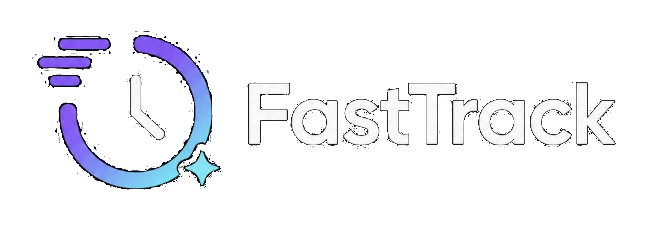
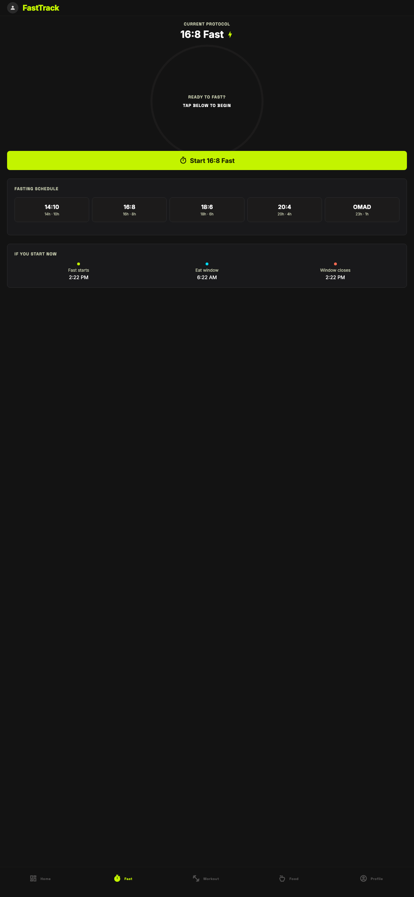
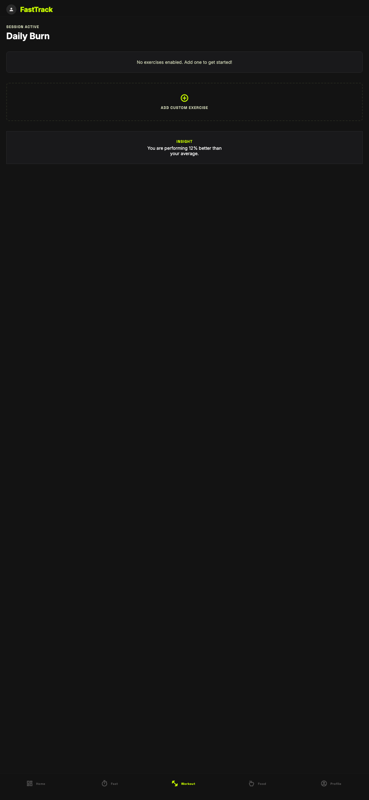
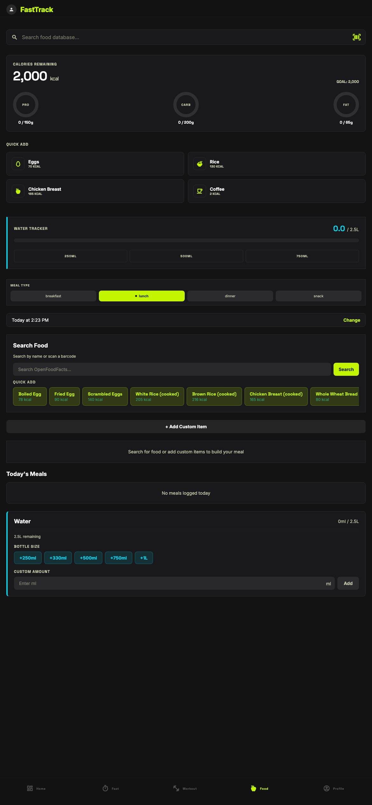

# FastTrack

<p align="center">
  
</p>

**Intermittent fasting, macro & workout tracker built with Expo + Supabase.**

FastTrack is a lightweight, streamlined mobile application designed for seamless tracking of intermittent fasting cycles, daily workout targets, macros, and hydration.

Existing fitness tracker apps have become visually cluttered or rely heavily on aggressive monetisation via premium tiers. I built this to escape that model and return to a streamlined, feature-rich experience at zero cost.

Expo's unified codebase reduces the overhead of native development while maintaining a high-performance experience across both iOS and Android.

---

## Screenshots

| Fasting | Workouts | Food Logging |
|---------|----------|--------------|
|  |  |  |

---

## Features

### Fasting
- **Countdown timer** with animated SVG progress ring
- **Schedule presets**: 14:10, 16:8, 18:6, 20:4, OMAD — plus custom
- **Weekly calendar** showing which days you fasted
- **Full month calendar** with tap-to-view fast details
- **Mood check-ins** during fasts with chart and timeline
- **Previous fasts** list with expandable detail and delete

### Workouts
- **Exercise panels** for pushups, crunches, sit-ups, squats + custom
- **Log sets** with stepper controls (no keyboard needed)
- **Progress tracking** with daily goal progress bars
- **Calorie estimation** based on reps and body weight

### Nutrition
- **Food search** via OpenFoodFacts (with barcode scanner)
- **Quick-add** common foods (eggs, rice, chicken, etc.)
- **Meal builder** with macro breakdown (calories, protein, carbs, fat)
- **Water tracking** with bottle presets and progress bar

### Profile & Settings
- **Achievements** for fasting streaks and workout milestones
- **Weekly stats** for fasting, water, and workouts
- **Weight tracking** with chart and goal weight
- **Unit preferences**: kg/lbs, cm/ft, ml/fl oz
- **Dark/light mode** with full theme support
- **Push notifications** for fast reminders, water, and milestones

---

## Tech Stack

| Layer | Technology |
|-------|-----------|
| Framework | Expo SDK 54 + Expo Router (file-based routing) |
| UI | React Native 0.81 + NativeWind v4 (Tailwind CSS) |
| State | Zustand (fasting, goals, theme) |
| Data Fetching | TanStack Query |
| Backend | Supabase (PostgreSQL, Auth, Realtime, Edge Functions) |
| Auth | Supabase Auth + expo-secure-store (native) / localStorage (web) |
| Native Modules | expo-camera (barcode), expo-notifications, expo-secure-store |
| Icons | Hugeicons |
| Animations | react-native-reanimated |
| Charts | react-native-svg |
| Dates | date-fns |
| OTA Updates | EAS Update |
| iOS Build | EAS Build + personal-team signing (no Apple Developer Program needed for personal use) |

---

## Getting Started

### Prerequisites

- [Node.js](https://nodejs.org/) 18+
- [Expo CLI](https://docs.expo.dev/get-started/installation/)
- [Supabase CLI](https://supabase.com/docs/guides/cli) (for database)

### Installation

```bash
git clone https://github.com/ashcdev-hub/FastTrack.git
cd FastTrack
npm install
```

### Environment Variables

Create a `.env` file:

```
EXPO_PUBLIC_SUPABASE_URL=https://your-project.supabase.co
EXPO_PUBLIC_SUPABASE_ANON_KEY=your-anon-key
```

### Running

```bash
npx expo start --web --port 8081    # Web
npx expo start --ios                 # iOS
npx expo start --android             # Android
```

### Building for iPhone (Standalone App)

You can build and install FastTrack directly on your iPhone **without an Apple Developer Program membership** (free, using a personal team). Full instructions are in [AGENTS.md](AGENTS.md#building-for-ios-standalone-app).

Quick summary:
```bash
npm i -g eas-cli
eas login
eas init                            # one-time
eas update:configure                # one-time
npx expo prebuild --clean --platform ios
# Open ios/FastTrack.xcworkspace in Xcode, set Personal Team signing
npx expo run:ios --device           # build + install to your iPhone
```

For JS-only changes after first install:
```bash
eas update --branch production --message "fix description"
```

---

## Project Structure

```
FastTrack/
├── app/                    # Expo Router screens
│   ├── (tabs)/             # Bottom tab navigation
│   │   ├── index.tsx       # Fast tab
│   │   ├── workouts.tsx    # Workouts tab
│   │   ├── log-food.tsx    # Log tab
│   │   └── profile.tsx     # Me tab
│   ├── (auth)/             # Login & signup
│   ├── (onboarding)/       # Onboarding wizard
│   └── settings.tsx        # Settings screen
├── components/             # 26 reusable components
├── hooks/                  # 13 custom hooks
├── lib/                    # Utilities, types, theme
├── store/                  # Zustand stores
└── supabase/               # Schema, migrations, edge functions
```

---

## Database

9 migrations covering:

| Migration | Description |
|-----------|-------------|
| `initial_schema` | Core tables (profiles, fasting_sessions, food_log, water_log, etc.) |
| `auto_profile_trigger` | Auto-create profile on signup |
| `fast_check_ins` | Mood check-in support |
| `add_fasting_schedule` | Schedule column on fasting sessions |
| `profile_settings` | Gender, age, height, BMI, notifications |
| `update_profile_trigger` | Trigger copies display_name |
| `workouts` | Workout goals and log tables |
| `weight_log` | Weight tracking with auto-sync to profile |
| `unit_preferences` | User preferred units (kg/lbs, cm/ft, ml/floz) |

All tables have RLS enabled with `auth.uid() = user_id` policies.

---

## Contributing

1. Create a feature branch from `main`
2. Make your changes
3. Run `npx tsc --noEmit` to verify TypeScript
4. Submit a pull request

---

## License

MIT License — see [LICENSE](LICENSE) for details.
